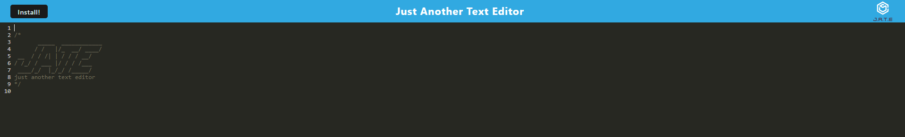

# PWA-Text-Editor

## Deployed URL
[Application](https://pwa-text-editor-ic0s.onrender.com/)

## Screenshots

## Description
    - As a developer I wanted to be able to create notes or code snippets with or without an internet connection
    - This project was built to be a progressive web application (PWA) that will save text when the web page is un foccused, if you launch the pwa those notes will still be there from the database and will function without an internet connection if needed.
    - This project taught me how build a functioning pwa using technologies such as an indexed database. I also learned how to implement CSS and Babel loader. 
    

## Installation
    - No installation required, see usage below 

## Usage
    -Click on the live url link at the top of the readme to be directed to the web page. Once there the user can start typing away, once clicking out of the window those changes will persist. If the user clicks on the install button, this will allow the user to use the app on or offline.

## Liscence
    MIT

## Credits
    Code fully written by Thomas Neylon, references were made to previous classwork, relying on stu 24 and stu 28. Most of the code wa sprovided via class as a boilerplate.
    
